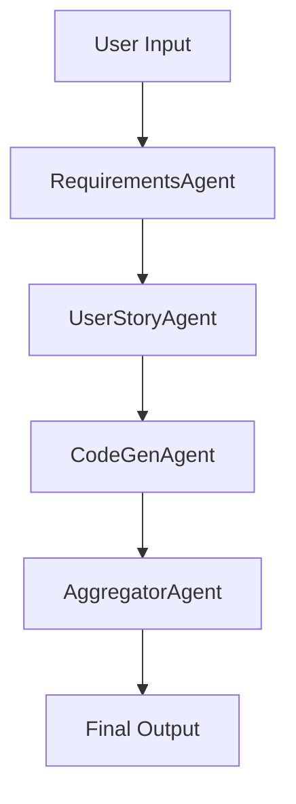

# 🧠 Multi-Agent Requirements to Code Generator

This is a Streamlit-based application that uses a multi-agent system powered by OpenAI to convert software requirements into clarified statements, user stories, and working jQuery code — all in a single workflow.

## 🚀 Features

- ✅ Requirements clarification via AI analyst
- 📋 Automatic breakdown into 8 user stories
- 🔧 jQuery code generation per story
- 🧩 Final code aggregation into a single copy-pasteable file
- 🎯 Clean UI with interactive feedback and results

---

## 🤖 Agents Overview

The app uses the following autonomous agents powered by OpenAI:

### 1. **Requirements Agent**
- Role: Clarifies user-entered software requirements.
- Persona: Senior software analyst.

### 2. **User Story Agent**
- Role: Converts clarified requirements into 8 user stories. (Change 8 user stories to the number you want to generate)
- Output includes acceptance criteria in **Given/When/Then** format.
- Persona: Product Owner.

### 3. **CodeGen Agent**
- Role: Converts each user story into a jQuery code snippet.
- Persona: Senior jQuery Developer. (Please chage jQuery to any other lnguage as per your requirement)

### 4. **Aggregator Agent**
- Role: Merges all generated code snippets into a single, logical file.
- Persona: Senior Software Engineer.

---

## 📦 Installation

Clone the repo and install the dependencies:

```
git clone https://github.com/vivekdeshmukhrepos/multi_agent_requirement_to_code_generator
 
pip install -r requirements.txt
```

## 🛠 Usage
```streamlit run app.py```


## 🧱 Architecture Overview

This app is built using:

- **Streamlit** — interactive UI for entering requirements and displaying outputs.
- **Semantic Kernel Agents** — agent framework to orchestrate LLM-based roles.
- **OpenAI GPT-4** — the core language model powering each agent's reasoning.
- **Async Python** — used to manage agent conversations concurrently.



Each agent handles a specific stage and passes output to the next, resulting in clean, well-structured final code.